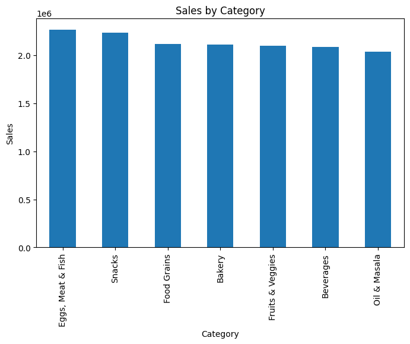

# Supermart Grocery Sales Analysis

## Objective
Analyze grocery sales data using Python to identify sales trends,
top-performing categories, regional performance, and profitability insights.

## Tools Used
- Python
- Pandas
- Matplotlib
- Seaborn

## Project Structure
- notebook/ : Jupyter notebook with full analysis
- report/   : HTML export of the notebook
- data/     : Dataset used for analysis

## Key Insights
- Egg, Meat & Fish category generated the highest sales
- Sales peak during year-end months
- High discounts negatively impact profit
- Few cities contribute most of the revenue

## Business Recommendations
- Focus promotions on top-performing categories
- Optimize discount strategy
- Improve supply planning during peak seasons

## 📊 Key Visualizations

### Sales by Product Category

**Insight:**  
Food categories such as Egg, Meat & Fish contribute the highest share of revenue.

---

### Monthly Sales Trend

**Insight:**  
Sales increase during year-end months, indicating seasonal demand patterns.

---

### Discount vs Profit Relationship

**Insight:**  
Higher discounts often lead to reduced or negative profit margins.
