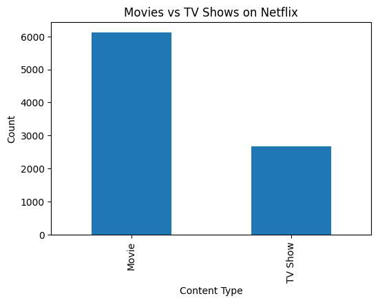
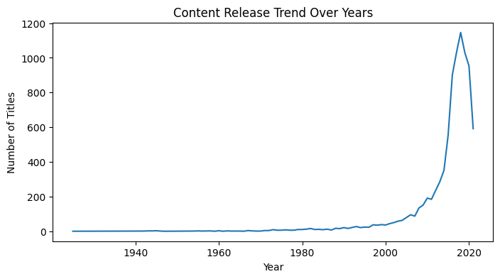

# Netflix Data Analysis (Python)

## 📌 Objective
The objective of this project is to analyze Netflix content data to understand
content distribution, genre trends, country-wise production, and release year
patterns using Python-based exploratory data analysis (EDA).

---

## 🛠 Tools & Technologies
- Python
- Pandas
- NumPy
- Matplotlib
- Seaborn
- Jupyter Notebook

---

## 📂 Dataset
The dataset contains information about Netflix movies and TV shows, including:
- Content type (Movie / TV Show)
- Title
- Director
- Country
- Release year
- Rating
- Duration
- Genres (`listed_in`)

---

## 🔍 Analysis Performed
- Data cleaning and handling missing values
- Movies vs TV Shows distribution
- Content growth trend over the years
- Country-wise content production
- Genre popularity analysis
- Content rating distribution

---

## 📊 Key Insights
- Netflix hosts more Movies than TV Shows.
- Content production increased significantly after 2015.
- The United States produces the highest number of titles.
- Drama and International Movies are the most common genres.
- TV-MA is the most frequent content rating.

---

## 💡 Business Recommendations
- Continue investing in movie production as it dominates the platform.
- Focus on high-demand genres such as Drama and International content.
- Expand content creation in emerging markets.
- Maintain a balanced rating mix to cater to diverse audiences.

---

## 📊 Key Visualizations

### Movies vs TV Shows Distribution

**Insight:**  
Netflix hosts significantly more Movies than TV Shows.

---

### Content Growth Over Years

**Insight:**  
Netflix content production increased rapidly after 2015.

---

### Top 10 Content Producing Countries

**Insight:**  
The United States dominates Netflix content production.
