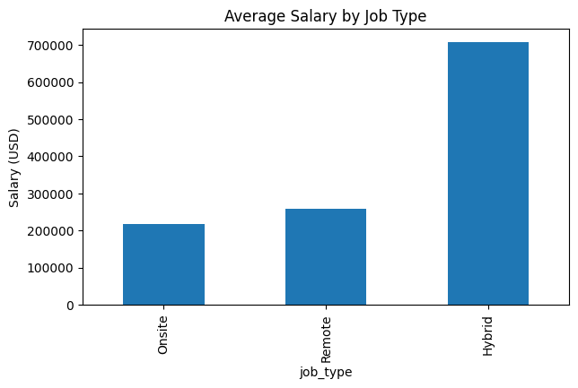

# Data Analyst & Data Science Jobs Salary Analysis

## 📌 Objective
The objective of this project is to analyze data analyst and data science job
salaries to understand how experience level, employment type, company size,
job type (remote/onsite), and role specialization impact salaries using
Python-based exploratory data analysis.

---

## 🛠 Tools & Technologies
- Python
- Pandas
- NumPy
- Matplotlib
- Seaborn
- Jupyter Notebook

---

## 📂 Dataset
The dataset contains job and salary information for data-related roles,
including:
- Job title
- Experience level
- Employment type
- Company size
- Job type (remote / hybrid / onsite)
- Salary (USD)
- Company and employee location

Dataset file:

---

## 🔍 Analysis Performed
- Data cleaning and preprocessing
- Handling duplicate and inconsistent salary columns
- Salary distribution analysis
- Experience-level salary comparison
- Employment type vs salary analysis
- Company size vs salary analysis
- Remote vs onsite salary comparison
- Identification of highest-paying job roles

---

## 📊 Key Visualizations

### Average Salary by Experience Level

**Insight:**  
Salaries increase significantly with experience, with executive-level roles
earning the highest compensation.

---

### Average Salary by Company Size

**Insight:**  
Large companies offer higher average salaries compared to small and
medium-sized organizations.

---

### Average Salary by Job Type

**Insight:**  
Remote roles provide higher average salaries than onsite and hybrid roles.

---

## 📈 Key Insights
- Experience level is a major driver of salary growth.
- Contract and remote roles often offer higher average compensation.
- Large organizations generally provide better salary packages.
- Specialized senior roles command significantly higher pay.

---

## 💡 Career & Business Recommendations
- Professionals seeking higher salaries should target senior or executive roles.
- Remote opportunities can offer better compensation and flexibility.
- Working with large companies may provide better long-term salary growth.
- Specializing in high-demand roles can significantly increase earning potential.

---

## 📁 Project Structure

---

## ✅ Conclusion
This project demonstrates how Python-based exploratory data analysis can be
used to understand salary trends in data-related careers. The insights from
this analysis can help job seekers make informed career decisions and assist
organizations in benchmarking compensation strategies.

---

## 👤 Author
**Fathima Robena**  
Aspiring Data Analyst  

GitHub: https://github.com/FathimaRobena1105

