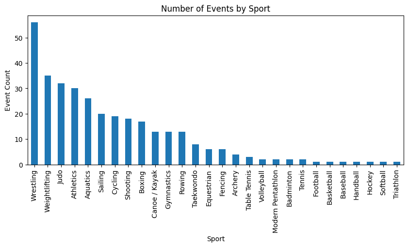

# Olympics Data Analysis (1976–2008)

## 📌 Objective
The objective of this project is to analyze Summer Olympic Games data from 1976
to 2008 to understand medal distribution, country performance, athlete
achievements, gender participation, and sport-wise dominance using Python-based
exploratory data analysis.

---

## 🛠 Tools & Technologies
- Python
- Pandas
- NumPy
- Matplotlib
- Seaborn
- Jupyter Notebook

---

## 📂 Dataset
The dataset contains Summer Olympics medal data from 1976 to 2008, including:
- Athlete name
- Gender
- Country
- Sport, discipline, and event
- Medal type (Gold, Silver, Bronze)
- Host city and year

Dataset file:

---

## 🔍 Analysis Performed
- Data cleaning and preprocessing
- City-wise Olympic hosting analysis
- Event and sport distribution analysis
- Top medal-winning athletes
- Gender distribution of medal winners
- Country-wise medal analysis over time
- Sport-wise country dominance
- Identification of athletes winning medals in multiple sports

---

## 📊 Key Visualizations

### Top 10 Countries by Total Medals

**Insight:**  
The United States leads in total Olympic medal counts across the analyzed years.

---

### Gender Distribution of Medal Winners

**Insight:**  
Male athletes won more medals historically, though female participation has
increased steadily over time.

---

### Top 10 Sports by Medal Count

**Insight:**  
Athletics and Swimming contribute the highest number of medals.

---

## 📈 Key Insights
- The United States consistently ranks among the top medal-winning countries.
- Certain sports dominate Olympic medal distribution across multiple editions.
- Gender participation has become more balanced over time.
- A small group of athletes achieved medals across multiple sports.

---

## 💡 Analytical Insights
- Sustained investment in sports infrastructure leads to consistent medal
  performance.
- Expanding support for female athletes increases participation and success.
- Focusing on medal-rich sports can significantly impact overall medal counts.

---

## 📁 Project Structure

---

## ✅ Conclusion
This project demonstrates how Python-based exploratory data analysis can be
used to uncover meaningful insights from historical Olympic data. The analysis
highlights long-term performance trends, country dominance, and the evolution
of gender participation in the Summer Olympic Games.

---

## 👤 Author
**Fathima Robena**  
Aspiring Data Analyst  

GitHub: https://github.com/FathimaRobena1105
